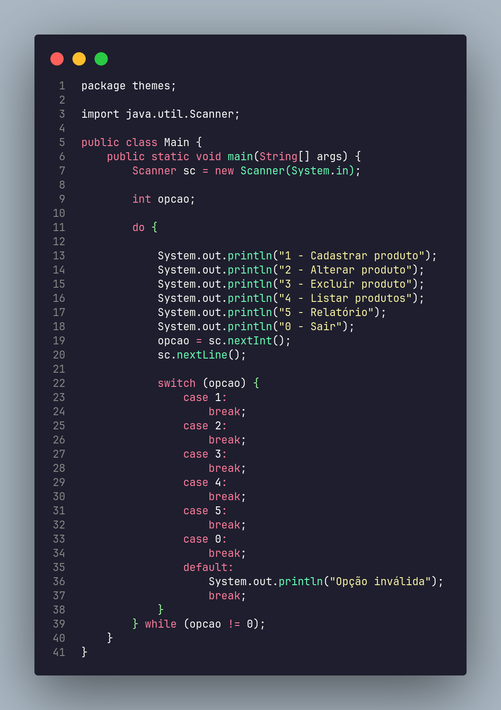

# arch-simple README

## Sobre o Tema
Um tema escuro inspirado no Arch Linux com cores simples e suaves.

## Atalhos úteis para editar Markdown
- Dividir editor (`Ctrl+\` no Windows/Linux, `Cmd+\` no macOS)
- Alternar visualização (`Shift+Ctrl+V` ou `Shift+Cmd+V`)
- Pressione `Ctrl+Espaço` para sugestões de snippets Markdown

## Mais informações
- [Suporte a Markdown no Visual Studio Code](http://code.visualstudio.com/docs/languages/markdown)
- [Referência de Sintaxe Markdown](https://help.github.com/articles/markdown-basics/)

**Aproveite o tema**

